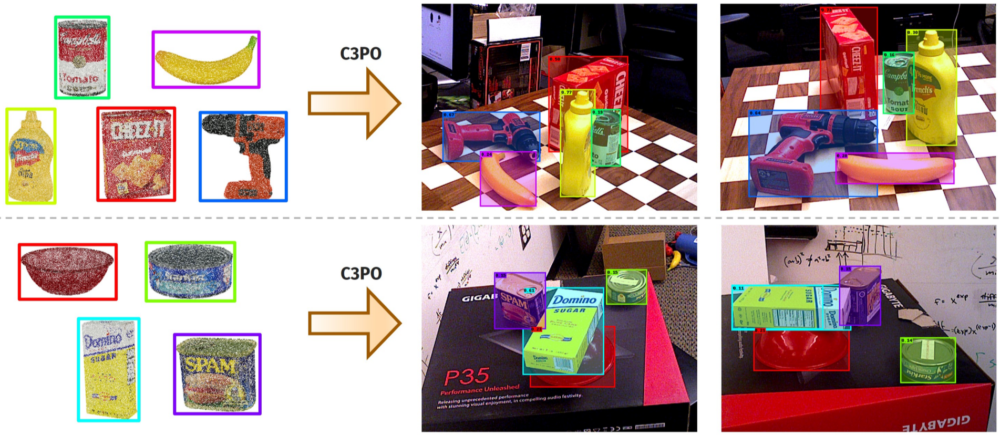

# C3PO (Cross-modal 3D Prompted Object detector)
Future repository for C3PO (Cross-modal 3D Prompted Object detector) 

Zero-shot object detection model based on RF-DETR and ULIP-2, pretrained on the MegaPose dataset.

Zero-shot prediction with C3PO using unseen 3D models (processed as point clouds) on unseen images from the YCBV benchmark.

